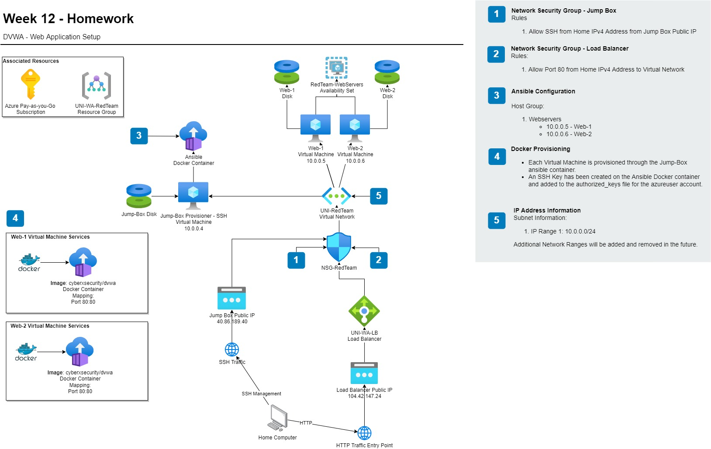

# Project Information

### Introduction
This Project was completed as part of a UWA CyberSecurity Bootcamp. additional content below has been added on top of what was required by the course as further proof of understanding and shaking of skills.

### Network Design
The following design below is a representation of an Azure Cloud setup of the Elk stack, including the setup of a Load Balancer and use of network security groups to limit the flow of traffic using rule based control.

In this design, all traffic was restricted to each of our personal IPv4 public IP addresses.

In addition, the below design is a replicated version setup in a Home lab environment.

**TODO:** picture of home lab network diagram.

### Resources
Below is a list of resources required to replicate this setup in a homelab enviorment. 

**Virtual Machines**
* x4 Ubuntu based machines (tested using Ubuntu Server LTS 20.04)
* x1 client workstation, or a device capable of displaying a browser.

**Networking Requirements**
* NAT or Bridged Network
* Traefik Reverse Proxy for HTTP traffic (simulating a Azure Load Balancer and NSG rule)

**Virtual Machine Specifications**
* x1 VM with 2vCPUs and at least 4Gb Memory.
* x2 VMs with 2vCPUs and 2Gbs Memory
* x1 VM with 1vCPU and 2Gbs Memory 

**Knowledge and Skills**
This project is designed to help new cyber security professionals log and monitor internal systems, including. the below are assumed skills
* Intermediate Linux directory navigation and diagnostic skills.
* Understanding of virtualization software and technologies, such as containerization and hypervisors

### Ansible Setup
In this document, you will find instructions on how to install